Goals for this lab
==================

This lab reinforces some ideas from previous labs:

-   working with Turtle Graphics
-   test-driven development

A key concept is:

-   generalizing functions

Step by Step Instructions
=========================

Step 0: Pair Partners
-------------------------------

The instructions for this lab were originally written under the assumption that pair programming was mandatory for this lab. However, Pair Programming is now OPTIONAL for this lab. It is ok to work SOLO on this lab, if you so choose.

@@@@@@@@@@@@@@@ GAUCHOSPACE FORUM MAYBE @@@@@@@@@@@@@@@@@

Step 1: Make sure you both understand the Unit Circle
-----------------------------------------------------

-   Both you and your pair partner need to understand the basic concepts of the Unit Circle in this section.
-   Read through them together, and make sure you do.

In this lab, you'll be working with the unit circle, a concept from trigonometry that will help us in drawing polygons and stars using Turtle Graphics.

I will assume you are familiar with the unit circle, and might just need a refresher course. (If you are truly seeing the unit circle for the first time, you may want to come to your instructor's office hours for a crash course.)

### Unit Circle Basics

The unit circle is a circle with radius 1—i.e. one unit of measurement, e.g. 1cm, or 1m, or 1inch—hence the name unit circle. (Sometimes, instead, we draw a unit circle with radius r, where r is a variable.)

The unit circle is labeled with angles that range from 0 degrees to 360 degrees (which is all the way around the circle.) However, we typically label the unit circle with angles in radians instead of degrees. This angles range from 0 radians to 2π radians. All the way around the circle is 2π radians.

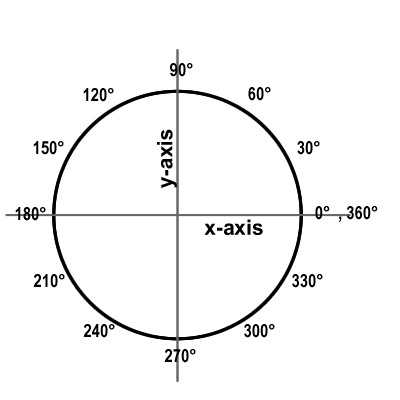

The points on the unit circle at 0, π/2, π and 3π/2 are (1,0), (0,1), (-1,0), and (0,-1), respectively, as shown in the left hand figure below. The right hand figure shows that sometimes we draw circle where the radius is given by r, instead of being exactly 1.

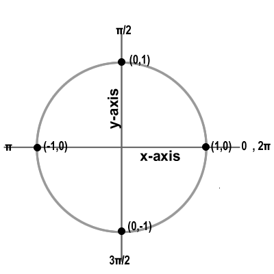 | 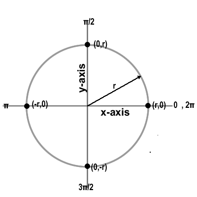
--- | --- 

### Finding a point on the unit circle

We can find the (x,y) coordinates any point on the unit circle if we know the angle, by using some simple trigonometry properties—in particular, the first two of the well known SOH-CAH-TOA formulas:

-   sine is opposite over hypotenuse
-   cosine is adjacent over hypotenuse

With these in mind, we can see that in the pictures below:

-   cos is adjacent/hypotenuse, which is x/r, therefore: cos (θ)  = x/r, and therefore x = r cos (θ)

<!-- -->

-   sin is opposite/hypotenuse, which is y/r, therefore: sin (θ)  = y/r, and therefore y = r sin (θ)    

| 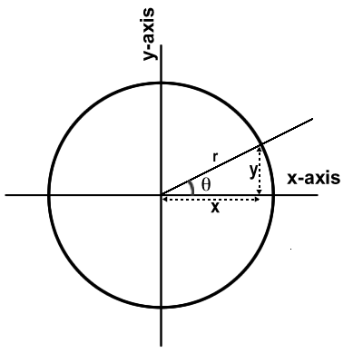 | 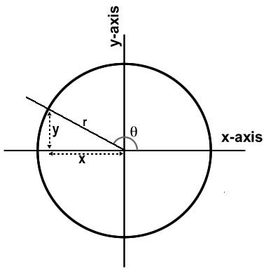 |
| --- | --- |
| 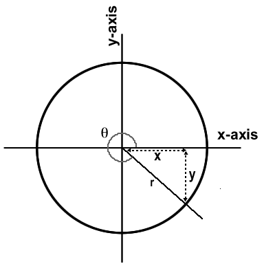 ||

Now consider just four more pictures of the unit circle—I promise, these are the ones that will lead us into the Python coding!

|||
| --- | --- |
| 3 points distributed evenly around the unit circle | 5 points distributed evenly around the unit circle |
| 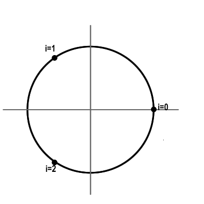 | 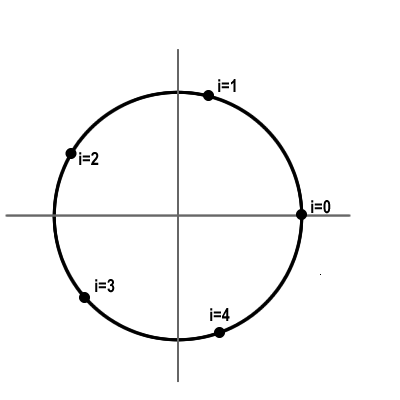 |
| 6 points distributed evenly around the unit circle | 8 points distributed evenly around the unit circle |
| 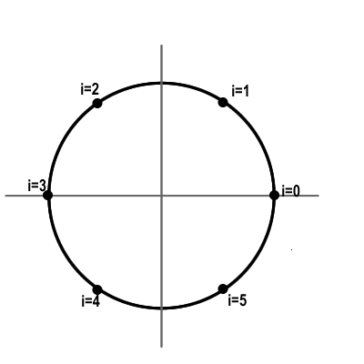 | 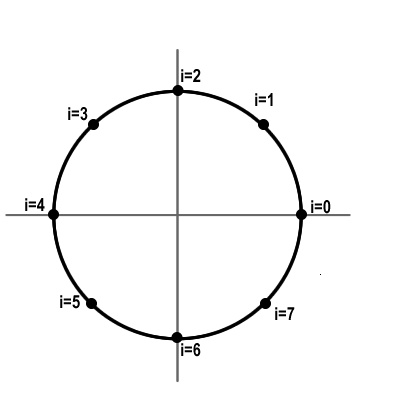 |

### The key points you must understand before going further

-   Generalizing the idea shown in the four pictures above, we have a unit circle with n points, labeled 0 through n-1, distributed evenly around the unit circle.
-   We can speak of "point i" of these n points, e.g. point 0, or point 3, or point 6.
-   If we wanted to draw a circle like this, and make it exact, we might need answers to questions like these:
    -   In the circle with 5 points what are the x and y coordinate of point 3?
    -   In the circle with 8 points, what are the x and y coordinates of point 6?
-   Those questions can be answered using the formula x = r cos(θ) and y = r sin (θ)

To be able to answer those last questions, we will write two Python functions called:

-   `ithOfNPointsOnCircleX(i,n,r)`
    -   This function returns the x coordinate of point i on a circle with n points, and radius r
-   `ithOfNPointsOnCircleY(i,n,r)`
    -   This function returns the y coordinate of point i on a circle with n points, and radius r

You are now ready to look at some Python code!

Step 4: Decide whose account you are going to work in
-----------------------------------------------------

Note if you are working on CSIL: DO NOT share passwords with each other. That is a violation of your account agreement, and can result in suspension of your computing privileges at UCSB.

Instead, what you should do is:

-   Decide whose account you are going to work in for today's work session.
-   **At the end of every work session, copy your work to the other person's account.**
-   That way, if your pair partner [gets hit by a bus](http://discuss.fogcreek.com/joelonsoftware/default.asp?cmd=show&ixPost=149219), you can continue working without him/her—you aren't 'out of luck'.

Here's how to copy files from one account to another:

Let's suppose that you did all the work in person1's account, and you now want to copy that into person2's account.

-   Person2 should log in. You can log in on a separate computer, or just use one of the terminal windows and use the command: `ssh person2@csil.cs.ucsb.edu`
-   Person2 cd's into their *~/cs20* directory
-   Person2 types this command:
    `scp -r person1@csil.cs.ucsb.edu:cs8/lab07 lab07.snapshot.date.time`

In that command:

-   replace person1 with person1's CSIL username (e.g. jsmith)
-   replace date.time with the date and time (e.g. Aug12.1.15pm)
-   don't include any slashes or spaces in the date.time string—it must be a valid part of a filename--periods and dashes are ok though

Example: `scp -r fredjones@csil.cs.ucsb.edu:cs8/lab07 lab07.snapshot.aug12.1.15pm`

-   After you type this command, you'll be prompted for a password. Person1 should type his/her password.
-   Don't **_share_** the password, just have person1 type it in person2's window.
-   If it works, there will now be a directory called `lab07.snapshot.date.time` in person2's directory that is a complete copy of the *~/cs20/lab07* directory from person1's account.
-   Please read the "final thoughts" below so that you understand what the proper use of this process it—it is a powerful command, but it has the potential to be abused. With great power comes great responsibility.

It is only necessary for one of you to submit the work via turnin, as long as both names are in each file.

But, if you are the person whose account is not the one from which the turnin step is done, be SURE that your name appears! You need to work carefully with your pair partner to avoid misunderstandings and problems.

### Some final thoughts on this step

-   In this class pair programming is permitted on *some* assignments.
-   The scp command above *could* be used to copy code from one account to another on assignments where you are not permitted to work together—but **_that would be wrong_**.
-   So don't do that. :)

Step 5: Create a directory for lab07 on one of your accounts
------------------------------------------------------------

First, create a directory (folder) called lab07, inside your cs20 folder, which is in turn, inside your home directory.

A short way to say that is: create a directory *~/cs20/lab07*

You can do this in one step with the command:

    -bash-4.2$ mkdir ~/cs20/lab07
    -bash-4.2$

Then cd into that directory. This too can be done in one step:

    -bash-4.2$ cd ~/cs20/lab07
    -bash-4.2$

Step 6: Copy `lab07Funcs.py` and `lab07Tests.py`
--------------------------------------------

Bring up IDLE (the command is `idle`, and use File =\> New to open a window for function definitions.

In one window, create a new file called `lab07Funcs.py` with the code from this link:

-   [lab07Funcs.py](https://raw.githubusercontent.com/UCSB-CMPTGCS20-S16/CS20-S16-lab07/master/lab07Funcs.py?token=AKSMwiIJ5L-zQZWKXmHMI4FrmiFARLgqks5XQ_IrwA%3D%3D)

and in the other window, put the code from this link in a file called `lab07Tests.py`:

-   [lab07Tests.py](https://raw.githubusercontent.com/UCSB-CMPTGCS20-S16/CS20-S16-lab07/master/lab07Tests.py?token=AKSMwtyftbEMKCE0ZQjUimVLk2IjLm7Oks5XQ_KxwA%3D%3D)

Step 7. Run the `lab07Tests.py` file for the first time
-----------------------------------------------------

Then, choose Run =\> Run Module, and see the output. You should see something familiar: a bunch of failing tests.

What's different this week is that getting the tests to pass isn't the end of the story. Once the tests pass, we can use the code to do something awesome.

Nevertheless, the first job is to get the tests to pass.

1.  In the file, find the section for the `ithOfNPointsOnCircleX()` function tests.
2.  Directly under it, you'll see some test cases—but not all the test cases are complete. Test case number 11 for the `ithOfNPointsOnCircleX` needs you to finish it, using your knowledge of the unit circle.

-   -   Ask yourself, in test case 11, what is the value of 'xxx'? That is, what is the x value for the second of three points on this circle?
    -   Ask yourself, what is the value of i? That is, which point are we trying to find?
    -   Ask yourself, what is the radius of this circle?
    -   With that information, figure out: what should the x value of that point be?
    -   Uncomment this test and fill it in.

1.  Then, run the file again, and you'll see that `ithOfNPointsOnCircleX` now has twelve test cases. They are still all failing, but you should have a much better idea of how to fill in the formula, now that you've figured out one of the test cases for yourself.
2.  So, now, replace the stub of `ithOfNPointsOnCircleX` with the correct formula. Now all eight test cases should pass.
3.  Do the same for `ithOfNPointsOnCircleY`: first fix up all the test cases that need fixing up.
4.  Then, and only then, replace the stub with the correct formula. Now that all your test cases are passing, you are almost ready for the graphics part of this lab!
5.  Before you move on, though, take a moment to clean up any @@@ type comments between the start of the file, and the end of the test cases for `ithOfNPointsOnCircleY`. You may like to use the Edit / Find menu option to look for @@@. This can make finding these a lot easier.

We are ready for the next step, where we do some graphics.

Step 9: Finishing up the `drawPolygon` function
---------------------------------------------

Now, locate the `drawPolygon()` function. This function is almost, but not quite complete.

Since this function's purpose is to draw something, rather than to return something, we can't check it with the normal `assertEquals()` methods that we use in "automatic" test cases.

The only effective way we have of testing it is to try drawing something, and use our human eyes to look at the output.

(There may be ways of testing graphics functions that can be automated, but those are well beyond the scope of what we can cover in an intro course.)

First take a moment to read over the function and understand how it works.

As a reminder, there are two different ways we can draw graphics with Turtles: relative, and absolute.

-   When we use the functions: `forward(distance)`, `backward(distance)`, `right(angle)`, and `left(angle)`, we are doing **relative** movements with the turtle. Where the turtle ends up, and which way it is pointing *depends on where the turtle was, and which way it was pointing* before we made the function call.
-   When we use `goto(x,y)` we tell the turtle exactly where to go. Where it ends up does NOT depend on where the turtle was before the `goto(x,y)` call was done. In the same way, we can force the turtle to point in a certain direction by using `setheading(angle)`. These are **absolute** commmands, since they specify absolutely what the new turtle's state should be and *do not depend on where the turtle was, and which way it was pointing* before we make the function call.

In this `drawPolygon()` function, we tell the turtle exactly where to go in the Cartesian plane—we call this using "absolute" movements.

Again, as a reminder:

-   The `goto()` function takes two parameters, x and y, which indicate exactly where the turtle should go.
-   The `setheading()` function takes one argument, which is an angle in degrees that the turtle should face. The angles are the same as those on the unit circle, and are specified in degrees.
-   Notice the use of the for loop and the range function to draw all the lines—or almost all the lines—on the polygon.

Just below the `drawPolygon` function, there is a `tryIt()` function. This is a function that starts out with every line commented out except for the one that creates a Turtle named Sheila.

Near the bottom of the file, you'll find an if test that compares `__name__=="__main__"` and inside that if test there is a commented out call to the `tryIt()` function. Uncomment this call.

You can then "uncomment" one line at a time of the code inside the `tryIt()` function to see various polygons being drawn. Uncomment one of the lines, run the file and try running the `lab07Funcs.py` file.

You'll notice that you get a polygon that is missing one side.

Now, fix the `drawPolygon` function. There are at least two ways to go about it:

-   One way is to find the location in the definition of `drawPolygon` indicated by @@@, and add a line of code there.
-   Another way is to adjust some other part of the file. Either method is fine, as long as the result ends up drawing a regular polygon, according to the "contract" in the comments that appear just before the function.

Once `drawPolygon` is working, move on to `drawStar`. Try uncommenting the lines in `tryIt()` one at a time that call `drawStar()`. You should see that the call when n=3 does nothing, but the call when n=5 or n=6 will give you a five or six pointed star.

Once that is all working, you are ready for the next step.

Step 10: Generalizing the `drawStar` function
-------------------------------------------

The `drawStar` function has one drawback: although (0,0) doesn't exactly appear in the function, in a sense the "idea" that the star is drawn centered at (0,0) is nevertheless *hard coded* in the drawStar function. To make the function more general, what we need to do is add parameters x and y, and then add those values in, every time we make a call to the "goto" function of the Turtle.

Find the place in the file where there is a comment indicating you should add the function `drawStarAtXY()`.

Read the comment, and then follow the instructions there to create this function.

Once you've coded it, you can test it by running the function:

    testDrawStarAtXY()

If it works, you should see the stars that appear in this picture. (Note that your turtle will probably just look like a triangle rather than like a turtle as in this picture.)

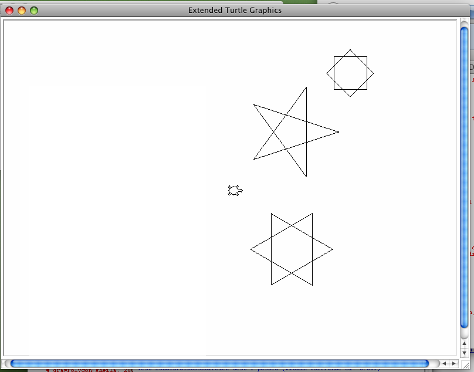

When you get this, you may move on to the next step—but first, do a visual inspection of your code to remove any remaining @@@ comments in the part you've finished.

Step 10: Generalizing the `drawPolygon` function
----------------------------------------------

Now, do exactly the same thing for `drawPolygon` that you did for drawStar. You'll find comments for a `drawPolygonAtXY()` function, and a `testDrawPolygonAtXY()` function waiting for you in the file.

The finished product should look like this:

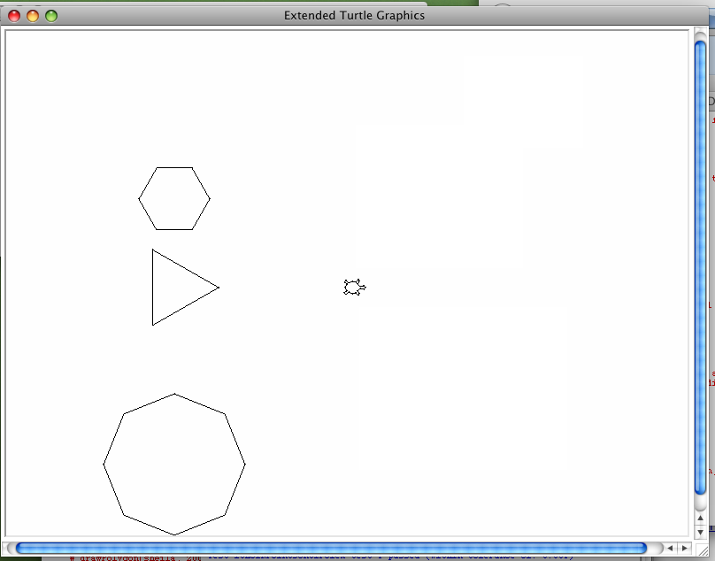

When you get this, you may move on to the next step—but first, do a visual inspection of your code to remove any remaining @@@ comments in the part you've finished.

Step 11: Uncomment the call to `Main()` function
----------------------------------------------

You'll see a call to the `Main()` function near the bottom of the file inside an if test for `__name__== "__main__"`.

The `Main()` function just calls the two test functions you've already been working with. Comment out the `tryIt()` function call, and uncomment the `Main()` function call. Just uncomment and test. You should get this as your output (except that the turtle may not look quite as "fancy".)

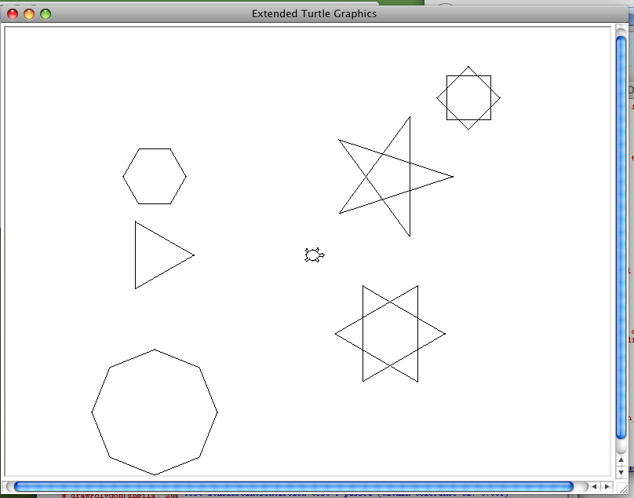

Step 12: Check over your program and Submit it
----------------------------------------------

Before you submit your assignment, check these things:

-   Did you remove all the @@@ comments, and do what they indicated you should?
-   Do all of your test cases pass?
-   Does your drawing look like the final stage picture?
-   Are your files `lab07Funcs.py` and `lab07Tests.py` inside the *~/cs20/lab07* directory?
-   Finally, look over the grading rubric (near the end of this web page), and make sure that you did everything called for there.

@@@@@@@@@@@@@ FIGURE OUT SUBMIT STUFF @@@@@@@@@@@@@@@

To submit your assignment, you need to bring up a terminal window on CSIL.

Go to a shell prompt on csil, navigate to a directory one level higher than your lab07 directory, and use the command <strong>turnin lab07@cs8 lab07</strong> to submit the files in your lab07 directory.

If you aren't sure how, look at the more detailed instructions in previous lab assignments.

Evaluation and Grading Rubric
=============================

-   Professional software documentation practices
    -   (10 pts) Naming the files lab07Funcs.py and lab07Tests.py
    -   (10 pts) Having a comment at the top of the file that complies with the instructions

<!-- -->

-   Writing test cases
    -   (10 pts) Completing ithOfNPointsOnCircleX test case 11
    -   (60 pts) Completing ithOfNPointsOnCircleY test cases 2 though 8 (10 points each)

<!-- -->

-   Replacing a stub with real code
    -   (20 pts) Replace the stub for the ithOfNPointsOnCircleX function so the test cases pass,
    -   (20 pts) Replace the stub for the ithOfNPointsOnCircleY function so the test cases pass

<!-- -->

-   Fixing broken code
    -   (20 pts) Fix the drawPolygon function so it operates properly

<!-- -->

-   Generalizing code with hard-coded functionality
    -   (25 pts) Generalizing the drawStar function so that it can draw a star anywhere in the Cartesian Plane
    -   (25 pts) Generalizing the drawPolygon function so that it can draw a star anywhere in the Cartesian Plane

<!-- -->

-   Following Instructions
    -   (20 pts) Removing all @@@ comments from your final submission
    -   (10 pts) Having an uncommented call to the Main() function that tests your submission as soon as it is run
    -   (40 pts) Submitting on time and according to instruction
    -   (30 pts) Making a post on the Gauchospace forum with your pair's names and the times you can work together

Copyright 2014, Phillip T. Conrad, CS Dept, UC Santa Barbara. Permission to copy for non-commercial, non-profit, educational purposes granted, provided appropriate credit is given; all other rights reserved.
